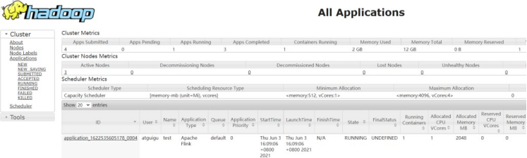
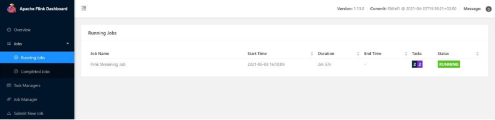

## 前言
好久没写笔记了。Flink学得实在令人失望，这么多就属他最难搞得系统搞了
可谓是杜预之才，令人失望 哎
哦对怎么看flink都应该是数据框架引擎的偏后期学的，其他的我有空再补上，先搞完这个
> 江畔何人初见月，江月何年初照人
## 部署模式

### 1、会话模式

        会话模式是先启动集群，然后客户端将用户的程序代码转换成数据流图（Dataflow Graph），并最终生成作业图（JobGraph），然后一并发送给JobManager；作业提交后，JobManager 为作业分配相应的资源，作业完成就释放资源，而集群并不因为没有作业就关闭。

        当然缺点也是显而易见的：因为资源是共享的，所以资源不够了，提交新的作业就会失败。另外，同一个 TaskManager 上可能运行了很多作业，如果其中一个发生故障导致 TaskManager 宕机，那么所有作业都会受到影响（因为当作业很多的时候，我们的资源TaskSlot被占满了，所以当有TaskManager节点宕机时，就无法保证容错，因为已经没有空闲资源供使用了，而且后面可能还有一堆作业等着处理呢）。

### 2、单作业模式

        单作业模式也很好理解，就是严格的一对一，集群只为这个作业而生。同样由客户端运行应用程序，然后启动集群，作业被提交给 JobManager，进而分发给 TaskManager 执行。作业完成后，集群就会关闭，所有资源也会释放。这样一来，**每个作业都有它自己的 JobManager管理**，占用独享的资源，即使发生故障，它的 TaskManager 宕机也不会影响其他作业。（注意：是作业，不是应用，我之前一直觉得这里的作业指的就是应用，但其实不是，一个应用可能包含一个或多个作业。）单作业模式就是为一个作业开启一个集群，就是这么奢侈，但对于运行时间长，需要资源量大的场景，这种牺牲是值得的。  
        这些特性使得单作业模式在生产环境运行更加稳定，所以是实际应用的首选模式。需要注意的是，Flink 本身无法直接这样运行，所以单作业模式一般需要借助一些资源管理框架来启动集群，比如 YARN、Kubernetes。

### 3、应用模式

        应用模式与单作业模式，都是提交作业之后才创建集群；单作业模式是通过客户端来提交的，客户端解析出的每一个作业对应一个集群；而应用模式下，是**直接由 JobManager 执行应用程序的，并且即使应用包含了多个作业，也只创建一个集群**。

### 总结

1.  在会话模式下，集群的生命周期独立于集群上运行的任何作业的生命周期，并且提交的所有作业共享资源。
2.  而单作业模式为每个提交的作业创建一个集群，带来了更好的资源隔离，这时集群的生命周期与作业的生命周期绑定。
3.  最后，应用模式为每个应用程序创建一个会话集群，在 JobManager 上直接调用应用程序的 main()方法。

### 拓展
一个详细的例子来说明如何在生产环境中使用 Flink 的应用模式。

#### 示例：实时数据处理应用程序

假设你在一家电商公司工作，负责搭建一个实时数据处理应用程序，该应用程序要从不同的源接收数据、进行多步骤的处理，并最终将结果存储在不同的数据存储系统中。该应用程序由以下几个作业组成：

##### 作业 1：用户行为数据提取

-   **输入**：Kafka 中的用户行为数据流，包括页面浏览、点击、搜索等事件。
-   **处理**：解析原始数据、清洗无效记录。
-   **输出**：将处理后的数据写入到 Apache Kafka 的主题或暂存到内存数据库中供下游作业使用。

##### 作业 2：实时推荐计算

-   **输入**：作业 1 产生的清洗过的用户行为数据。
-   **处理**：基于行为数据计算实时推荐内容，如热门商品、个性化推荐等。
-   **输出**：推荐结果写入 Redis 以便快速响应用户请求。

##### 作业 3：数据分析与统计

-   **输入**：用户行为数据和实时推荐数据。
-   **处理**：聚合、统计关键指标，如实时用户活跃度、订单转化率等。
-   **输出**：统计结果写入数据仓库或 Elasticsearch 以供分析和可视化。

##### 作业 4：告警系统

-   **输入**：数据流中订单信息和推荐数据。
-   **处理**：检查是否有异常模式（如商品库存过低、异常流量峰值）。
-   **输出**：如果有异常情况，发送告警到运维或负责人员的通知系统。

#### 应用模式的优势

1.  **共享资源**：这四个作业共享同一个 Flink 集群，减少了不同集群间的资源分配和管理开销。
2.  **统一管理**：应用模式中的 `JobManager` 管理整个应用程序的生命周期，可以协调不同作业之间的依赖关系和启动顺序。
3.  **长时间运行**：整个应用程序可以保持长时间运行，满足持续处理和实时响应的需求，不需要每次作业结束后重启集群。
4.  **简化的运维**：只需要维护一个 Flink 集群实例，而不是为每个作业分别维护集群。

### 部署方式

在生产环境中，你可以通过 Flink CLI 或者一个集群管理工具（如 Kubernetes）部署整个应用程序。例如，在 Kubernetes 中，可以将整个应用程序打包成一个 Docker 镜像并部署，使用 `application mode` 启动时，会通过如下命令提交：

```bash
flink run-application -t kubernetes-application \
  -Dkubernetes.cluster-id=my-flink-app \
  -Dkubernetes.namespace=flink-namespace \
  -c com.mycompany.MyFlinkApp \
  my-flink-app.jar

```
在这个 `my-flink-app.jar` 包中，包含了多个 `FlinkJob` 类，每个类代表一个作业，通过一个主类 `MyFlinkApp` 调用各作业，管理它们的启动顺序和配置。

### Yarn

        Flink 独立（Standalone）模式由 Flink 自身提供资源，无需其他框架，这种方式降低了和其他第三方资源框架的耦合性，独立性非常强。但是比如独立模式中的单作业模式不依赖外部资源管理框架就无法实现。而我们刚开始提到的提交Job的方式默认就是Flink独立模式下的会话模式。

        我们知道，Flink只是一个流式计算框架，它并不擅长资源的管理，所以我们这里使用YARN，而且即使 Flink 的独立模式本就支持会话模式，我们还是使用YARN来管理，毕竟 YARN 是专业的资源调度框架嘛。

Yarn 部署的流程：

        客户端把 Flink 应用提交给 Yarn 的 ResourceManager, Yarn 的 ResourceManager 会向 Yarn 的 NodeManager 申请容器。在这些容器上，Flink 会部署JobManager 和 TaskManager 的实例，从而启动集群。Flink 会根据运行在 JobManger 上的作业所需要的 Slot 数量动态分配 TaskManager 资源。


#### 1.启动集群
（1）启动 hadoop 集群(HDFS, YARN)。
（2）执行脚本命令向 YARN 集群申请资源，开启一个 YARN 会话，启动 Flink 集群。
$ bin/yarn-session.sh -nm test	
可用参数解读：
⚫-d：分离模式，如果你不想让 Flink YARN 客户端一直前台运行，可以使用这个参数，即使关掉当前对话窗口，YARN session 也可以后台运行。
⚫-jm(--jobManagerMemory)：配置 JobManager 所需内存，默认单位 MB。
⚫-nm(--name)：配置在 YARN UI 界面上显示的任务名。
⚫-qu(--queue)：指定 YARN 队列名。
⚫-tm(--taskManager)：配置每个 TaskManager 所使用内存。
YARN Session 启动之后会给出一个web UI 地址以及一个 YARN application ID，如下所示，用户可以通过web UI 或者命令行两种方式提交作业。

```bash
15:54:27,070  INFO  org.apache.flink.yarn.YarnClusterDescriptor [] - Found Web Interface hadoop104:39735 of application 'application_1622535605178_0003'.
JobManager Web Interface: http://hadoop104:39735
```


#### 2.提交作业  yarn会话模式

（1）通过Web UI 提交作业
这种方式比较简单，与上文所述 Standalone 部署模式基本相同。
（2）通过命令行提交作业
① 将 Standalone 模式讲解中打包好的任务运行 JAR 包上传至集群
② 执行以下命令将该任务提交到已经开启的 Yarn-Session 中运行。
客户端可以自行确定 JobManager 的地址，也可以通过-m 或-jobmanager 参数指定
JobManager 的地址，JobManager 的地址在 YARN Session 的启动页面中可以找到。
③ 任务提交成功后，可在 YARN 的Web UI 界面查看运行情况。

或者flink ui

```bash
$ bin/flink run
-c com.atguigu.wc.StreamWordCount FlinkTutorial-1.0-SNAPSHOT.jar
```
关闭
```bash
echo "stop" | ./bin/yarn-session.sh -id application_1699415564762_0001
```

#### 2.提交作业  yarn单作业模式
在 YARN 环境中，由于有了外部平台做资源调度，所以我们也可以直接向 YARN 提交一个单独的作业，从而启动一个 Flink 集群。
```bash
$	bin/flink	run	-d	-t	yarn-per-job	-c	com.atguigu.wc.StreamWordCount
FlinkTutorial-1.0-SNAPSHOT.jar
```
（3）可以使用命令行查看或取消作业，命令如下。
```bash
$ ./bin/flink list -t yarn-per-job -Dyarn.application.id=application_XXXX_YY
$ ./bin/flink cancel -t yarn-per-job -Dyarn.application.id=application_XXXX_YY
<jobId>
```
这里的 application_XXXX_YY 是当前应用的 ID，<jobId>是作业的 ID。注意如果取消作业，整个 Flink 集群也会停掉。

#### 2.提交作业  应用模式
应用模式同样非常简单，与单作业模式类似，直接执行 flink run-application 命令即可。
（1）执行命令提交作业。
```bash
#详细参数
flink run-application -t yarn-application -Djobmanager.memory.process.size=1024m -Dtaskmanager.memory.process.size=2048m -Dparallelism.default=4 path/to/your-flink-app.jar [application-arguments]

# -t yarn-application：指定目标环境为 YARN 应用模式。
# -Djobmanager.memory.process.size：设置 JobManager 的内存大小。
# -Dtaskmanager.memory.process.size：设置 TaskManager 的内存大小。
# -Dparallelism.default：设置作业的默认并行度。
# path/to/your-flink-app.jar：你的 Flink 应用程序的 JAR 包路径。(这种方式下 jar 可以预先上传到 HDFS，而不需要单独发送到集群，这就使得作业提交更加轻量了。)
# [application-arguments]：传递给应用程序的自定义参数。

#应用程序 JAR 包是 flink-app.jar
flink run-application -t yarn-application -Djobmanager.memory.process.size=1024m -Dtaskmanager.memory.process.size=2048m -Dparallelism.default=4 ./flink-app.jar --input-topic user-behavior --output-topic analysis-result

```
（2）在命令行中查看或取消作业。
```bash
$ ./bin/flink list -t yarn-application -Dyarn.application.id=application_XXXX_YY
$	./bin/flink	cancel	-t	yarn-application
-Dyarn.application.id=application_XXXX_YY <jobId>

```
#### yarn高可用
YARN 模式的高可用和独立模式（Standalone）的高可用原理不一样。
Standalone 模式中,  同时启动多个 JobManager,  一个为“领导者”（leader），其他为“后备”
（standby）, 当 leader 挂了, 其他的才会有一个成为 leader。
而 YARN 的高可用是只启动一个 Jobmanager, 当这个 Jobmanager 挂了之后, YARN 会再次启动一个, 所以其实是利用的 YARN 的重试次数来实现的高可用。
具体为：
>ZooKeeper 集成：Flink 可以使用 ZooKeeper 来协调 JobManager 的选举和状态存储。当主 JobManager 崩溃时，备用 JobManager 会接管其职责。
HDFS 作为状态存储：通过在 HDFS 中保存 JobManager 的 checkpoint 和 savepoint，可以在故障发生时恢复作业的状态。
