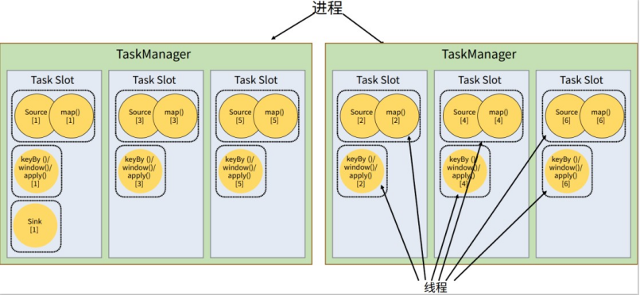

## 前言
从这一集开始抽象，但是还可以抢救，我觉得还是得类比一下spark来记
比如这样看看

>人在逆境还是别太妥协，还是得找点目标慢慢来，如果自己不想积极认真地生活，不管得到什么样的回答都没用
### 基本架构
两大组件：作业管理器（JobManger）和任务管理器（TaskManager）。对于一个提交执行的作业，JobManager 是真正意义上的“管理者”（Master），负责管理调度，所以在不考虑高可用的情况下只能有一个；而 TaskManager 是“工作者”（Worker、Slave），负责执行任务处理数据，所以可以有一个或多个。Flink 的作业提交和任务处理时的系统

#### jobmanager
##### JobMaster

-   JobMaster 是 JobManager 中最核心的组件，负责处理单独的作业（一个 JobMaster 对应一个 Job，因为一个 Flink 应用程序可能有多个作业，所以就可以有多个 JobMaster）。
-   在作业提交时，JobMaster 先就收到要执行的应用（客户端发送来的： Jar包、数据流图（dataflow graph）和作业图（JobGraph））。
-   JobMaster 会把作业图（JobGraph）转换成一个物理层面的数据流图，这个图被叫做 “执行图 ” （ExecutionGraph），它包含了所有可以并发执行的任务（可以并行执行多少任务，就分配给几个 TaskManager 的 TaskSlot 去）。JobManager 会向资源管理器（ResourceManager 注意：是Flink的资源管理器不是 YARN）发送请求，申请执行任务所需要的资源（如果资源不足，要么直接挂掉，要么就等待）。获得足够的资源后，就会将执行图（ExecutionGraph）发送给真正运行它们的 TaskManager 上。
-   在运行过程中，JobMaster 会负责所有需要中央协调的操作，比如检查点（checkpoint）的协调（定期做一个存盘，防止发生故障，状态丢失掉）。

##### ResourceManager

        这里的 ResourceManager 指的是 Flink 自带的 ResourceManager ，当然也可以用 YARN 这样的资源管理平台来代替管理。

-    一个 Flink集群中，只有一个 ResourceManager ，所谓的资源，指的就是我们的 任务槽（TaskSlot） 。TaskSlot 是能够执行并行任务的最小单位，它包含了机器用来执行计算的一组 CPU 和 内存资源。每个并行的任务都会分配到一个任务槽上去执行。
-   在有 YARN 做资源提供平台的情况下，当新的作业申请资源时，ResourceManager 会将有空闲槽位的 TaskManager 分配给 JobMaster。如果 ResourceManager 没有足够的任务槽，它还可以向资源提供平台发起会话，请求提供启动 TaskManager 进程的容器。另外，ResourceManager 还负责停掉空闲的 TaskManager，释放计算资源。

##### Dispatcher

-   Dispatcher 主要负责提供一个 REST 接口，用来提交应用，并且负责为每一个新提交的作业启动一个新的 JobMaster 组件。Dispatcher 也会启动一个 Web UI，用来方便地展示和监控作业执行的信息。Dispatcher 在架构中并不是必需的，在不同的部署模式下可能会被忽略掉（比如和一些资源管理平台集成起来之后，因为资源管理平台可以接受作业的提交）。


#### TaskManager
每一个 TaskManager 可以看做是一个 JVM 进程。

-   真正的工作者，在一个 Flink 集群中通常有多个 TaskManager 运行，每一个 TaskManager 都包含了一定数量的任务槽（task slots）。Task Slot 的数量限制了 TaskManager 能够并行处理的任务数量。
-   启动之后，TaskManager 回向 RsourceManager 注册自己的 TaskSlot （汇报自己有多少可用的资源），收到 RsourceManager 的指令后，TaskManager 就会将一个或多个 TaskSlot 提供给 JobMaster 去调用。JobMaster 就可以向 TaskSlot 分配任务（Tasks）去执行了。
-   在执行过程中，TaskManager 可以缓冲数据，还可以跟其他运行同一应用的 TaskManager交换数据。

### 作业流程
宏观上大致如此

（1）一般情况下，由客户端（App）通过分发器提供的 REST 接口，将作业提交给JobManager。

（2）由分发器启动 JobMaster，并将作业（包含 JobGraph）提交给 JobMaster。

（3）JobMaster 将 JobGraph 解析为可执行的ExecutionGraph，得到所需的资源数量，然后向资源管理器请求资源（slots）。

（4）资源管理器判断当前是否由足够的可用资源；如果没有，启动新的 TaskManager。

（5）TaskManager 启动之后，向ResourceManager 注册自己的可用任务槽（slots）。

（6）资源管理器通知 TaskManager 为新的作业提供 slots。


（7）TaskManager 连接到对应的 JobMaster，提供 slots。

（8）JobMaster 将需要执行的任务分发给TaskManager。

（9）TaskManager 执行任务，互相之间可以交换数据。
#### 独立模式
独立模式不细谈 大致如此第 4 步不会启动TaskManager，而且直接向已有的 TaskManager 要求资源， 其他步骤与上一节所讲抽象流程完全一致。
#### yarn会话模式
整个流程除了请求资源时要“上报”YARN 的资源管理器，其他与 上述流程几乎完全一样。
（4）+资源管理器向 YARN 的资源管理器请求container 资源。
（5）YARN 启动新的TaskManager 容器。
（6）TaskManager 启动之后，向 Flink 的资源管理器注册自己的可用任务槽。
#### yarn单作业（Per-Job）模式
在单作业模式下，Flink 集群不会预先启动，而是在提交作业时，才启动新的 JobManager。
区别只在于 JobManager 的启动方式，以及省去了分发器。当第 2 步作业提交给JobMaster，之后的流程就与会话模式完全一样了。

（1）客户端将作业提交给 YARN 的资源管理器，这一步中会同时将 Flink 的 Jar 包和配置上传到 HDFS，以便后续启动 Flink 相关组件的容器。
（2）YARN 的资源管理器分配 Container 资源，启动 Flink JobManager，并将作业提交给JobMaster。这里省略了 Dispatcher 组件。

#### yarn应用模式
应用模式与单作业模式的提交流程非常相似，只是初始提交给 YARN 资源管理器的不再是具体的作业，而是整个应用。一个应用中可能包含了多个作业，这些作业都将在 Flink 集群中启动各自对应的 JobMaster。

### 概念解析
#### 数据流图（Dataflow Graph）
所有的 Flink 程序都可以归纳为由三部分构成：Source、Transformation 和 Sink。
⚫Source 表示“源算子”，负责读取数据源。
⚫Transformation 表示“转换算子”，利用各种算子进行处理加工。
⚫Sink 表示“下沉算子”，负责数据的输出。

数据流图类似于任意的有向无环图（DAG），这一点与 Spark 等其他框架是一致的。图中的每一条数据流（dataflow）以一个或多个 source 算子开始，以一个或多个 sink 算子结束。keyBy，它就只是一个数据分区操作，而并不是一个算子。事实上，代码中我们可以看到调用其他转换操作之后返回的数据类型是 SingleOutputStreamOperator，说明这是一个算子操作；而 keyBy 之后返回的数据类型是 KeyedStream。
#### 并行度（Parallelism）

对于 Spark 而言，是把根据程序生成的 DAG 划分阶段（stage）、进而分配任务的。而对于 Flink 这样的流式引擎，其实没有划分 stage 的必要。因为数据是连续不断到来的，我们完全可以按照数据流图建立一个“流水线”，前一个操作处理完成，就发往处理下一步操作的节点
怎样实现数据并行呢？其实也很简单，我们把一个算子操作，“复制”多份到多个节点，数据来了之后就可以到其中任意一个执行。这样一来，一个算子任务就被拆分成了多个并行的“子任务”（subtasks），再将它们分发到不同节点，就真正实现了并行计算。
在 Flink 执行过程中，每一个算子（operator）可以包含一个或多个子任务（operator subtask），这些子任务在不同的线程、不同的物理机或不同的容器中完全独立地执行。

当前数据流中有 source、map、window、sink 四个算子，除最后 sink，其他算子的并行度都为 2。整个程序包含了 7 个子任务，至少需要 2 个分区来并行执行。我们可以说，这段流处理程序的并行度就是 2。

- 
    ```java
    stream.map(word -> Tuple2.of(word, 1L)).setParallelism(2);	
    ```
这种方式设置的并行度，只针对当前算子有效。
-   **env.setParallelism(2)**
相当于


这样代码中所有算子，默认的并行度就都为 2 了。我们一般不会在程序中设置全局并行度， 因为如果在程序中对全局并行度进行硬编码，会导致无法动态扩容。
这里要注意的是，由于 keyBy 不是算子，所以无法对keyBy 设置并行度。

-   在使用 flink run 命令提交应用时，可以增加-p 参数来指定当前应用程序执行的并行度， 它的作用类似于执行环境的全局设置：
    ```bash
    bin/flink run –p 2 –c com.atguigu.wc.StreamWordCount
    ./FlinkTutorial-1.0-SNAPSHOT.jar
    ```

（1）对于一个算子，首先看在代码中是否单独指定了它的并行度，这个特定的设置优先 级最高，会覆盖后面所有的设置。
（2）如果没有单独设置，那么采用当前代码中执行环境全局设置的并行度。
（3）如果代码中完全没有设置，那么采用提交时-p 参数指定的并行度。
（4）如果提交时也未指定-p 参数，那么采用集群配置文件中的默认并行度。

本身就是非并行的 Source 算子，所以无论怎么设置，它在运行时的并行度都是 1，
#### 算子链（Operator Chain）


把转换处理的很多个任务都连接在一起，合并成了一个“大任务”
在 Flink 中，并行度相同的一对一（one to one）算子操作，可以直接链接在一起形成一个“大”的任务（task），这样原来的算子就成为了真正任务里的一部分

将算子链接成 task 是非常有效的优化：可以减少线程之间的切换和基于缓存区的数据交换，在减少时延的同时提升吞吐量。
Flink 默认会按照算子链的原则进行链接合并，如果我们想要禁止合并或者自行定义，也可以在代码中对算子做一些特定的设置：


我们说 并行度相同且一对一的算子操作可以合并，但是为什么我们上面的 flatMap 和 keyed Aggregation 并没有合并？

>这是因为 flatMap 和 keyBy 这两种算子就不是一个 one to one 的传输方式，所以就不能合并。所以两个任务之间的箭头中间写着 "HASH" ，因为 keyBy 是基于 key 的 hashcode 分区的。

```java
// 禁用算子链
.map(word -> Tuple2.of(word, 1L)).disableChaining();
// 从当前算子开始新链
.map(word -> Tuple2.of(word, 1L)).startNewChain()
```
#### 作业图（JobGraph）与执行图（ExecutionGraph）
逻辑流图（StreamGraph）→ 作业图（JobGraph）→ 执行图（ExecutionGraph）→ 物理图（Physical Graph）。
回忆一下之前处理 socket 文本流的 StreamWordCount 程序：
env.socketTextStream().flatMap(…).keyBy(0).sum(1).print();	
如果提交时设置并行度为 2：

1.逻辑流图（StreamGraph）
这是根据用户通过 DataStream API 编写的代码生成的最初的 DAG 图，用来表示程序的拓扑结构。这一步一般在客户端完成。
2.作业图（JobGraph）
StreamGraph 经过优化后生成的就是作业图（JobGraph），这是提交给 JobManager  的数据结构，确定了当前作业中所有任务的划分。主要的优化为: 将多个符合条件的节点链接在一起合并成一个任务节点，形成算子链
3.执行图（ExecutionGraph）
JobMaster 收到 JobGraph 后，会根据它来生成执行图（ExecutionGraph）。ExecutionGraph
是 JobGraph 的并行化版本，是调度层最核心的数据结构。与 JobGraph 最大的区别就是按照并行度对并行子任务进行了拆分， 并明确了任务间数据传输的方式。
4.物理图（Physical Graph）
JobMaster 生成执行图后， 会将它分发给TaskManager；各个 TaskManager 会根据执行图部署任务，最终的物理执行过程也会形成一张“图”，一般就叫作物理图（Physical  Graph）。这只是具体执行层面的图，并不是一个具体的数据结构。物理图主要就是在执行图的基础上，进一步确定数据存放的位置和收发的具体方式。有了物理图，TaskManager 就可以对传递来的数据进行处理计算了。

所以我们可以看到，程序里定义了四个算子操作：源（Source）->转换（flatMap）->分组聚合（keyBy/sum）->输出（print）；合并算子链进行优化之后，就只有三个任务节点了；再考虑并行度后，一共有 5 个并行子任务，最终需要 5 个线程来执行。

**作业被划分为 5 个并行子任务（source \*1 ，flatMap \*2 ，keyed Aggregation+sink \*2），需要 5 个线程并行执行。那在我们将应用提交到 Flink集群之后，到底需要占用多少资源呢？是否需要 5 个 TaskSlot 来运行呢？**
1.任务槽（Task Slots）
之前已经提到过，Flink 中每一个 worker(也就是 TaskManager)都是一个 JVM 进程，它可
以启动多个独立的线程，来并行执行多个子任务（subtask）。
所以如果想要执行 5 个任务，并不一定非要 5 个 TaskManager，我们可以让 TaskManager 多线程执行任务。如果可以同时运行 5 个线程，那么只要一个 TaskManager 就可以满足我们之前程序的运行需求了。


上图是我们假设我们的并行度是 6 ，那对于上面 2 个 TaskManager、每个有 3 个 slot 的集群配置来说，难道就需要 并行度*任务数=6*5 = 30 个TaskSlot 才能正常运行吗？

其实上面的 6 个TaskSlot 就够用了，这是因为默认情况下，Flink 是允许子任务共享 slot 的。这样的结果就是，一个 TaskSlot 可以保存作业的整个管道。

这样的好处就是，当资源密集型（比如 keyby+window+apply）和非密集型（比如source+map）的任务同时放到一个 TaskSlot 中，它们就可以自行分配对资源占用的比例，从而保证最重的活分配给所有的 TaskManager。这样其实反而要比一个任务一个 TaskSlot 的分配方式更好一点，为什么呢？

        因为在之前 TaskSlot 不做资源共享的时候，每个任务都平等地占据了一个 TaskSlot ，但是对于非密集型任务，它并不需要多少计算资源，像读取转换这种操作是很快的。但是对于资源密集型任务，比如 window 往往会涉及大量的数据、状态存储和计算，往往需要耗费大量的时间。而上游的 source+map 任务很可能任务轻松的话，早早的忙完就没事干了。这样资源的利用就出现了极大的不平衡，“忙的忙死，闲的闲死”。

        解决的办法就是共享 TaskSlot 的计算资源，这样非资源密集型的任务完成之后，就可以也来帮忙完成资源密集型的任务。这样，当我们将资源密集型和非密集型的任务同时放到同一个 TaskSlot 后，它们就可以自行分配资源占用的比例，从而保证最重的活平均分配给每个 TaskSlot 。

        还有一个好处就是，当我们每个 TaskSlot 都保存了我们整个作业的所有任务后，即使别的 TaskManager 挂了 导致 TaskSlot 跟着挂了，那由于我们别的 TaskSlot 都包含整个作业的所有任务，这样我们的作业仍然可以完成，无非就是多忙一会罢了。

所以，一个作业的并行度（也就是它占据的 TaskSlot 的数量）取决于我们作业中最大子任务的并行度（因为要保证每个TaskSlot 保存所有任务嘛）。
这就是为什么 2 个 TaskSlot 就可以把我们的任务跑起来，上面我们一共有5个子任务，我们只用了 2 个TaskSlot，其中每个 TaskSlot 的任务如下：
```java
TaskSlot1:
    Source
    Flat Map
    Keyed Aggregation -> Sink(算子链)
 
TaskSlot2:
    Flat Map
    Keyed Aggregation -> Sink(算子链)
```


过这个例子也可以明确地看到，整个流处理程序的并行度，就应该是所有算子并行度中最大的那个， 这代表了运行程序需要的 slot 数量。


