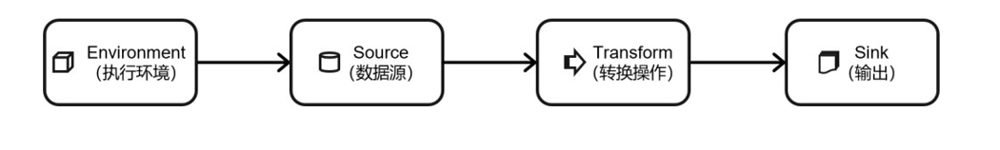
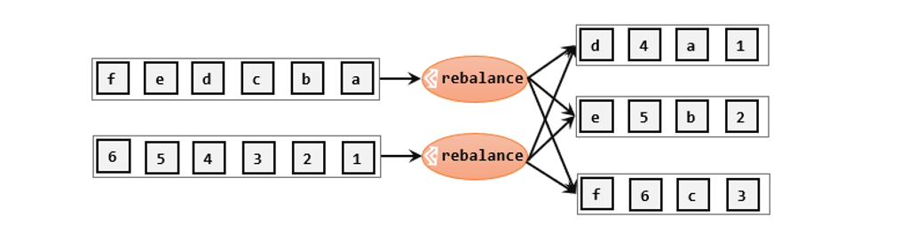
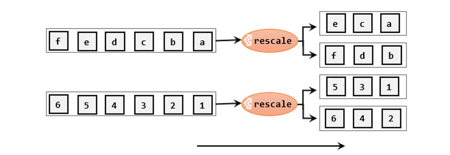
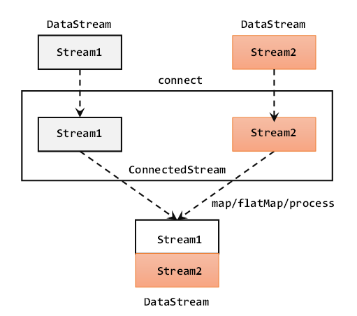
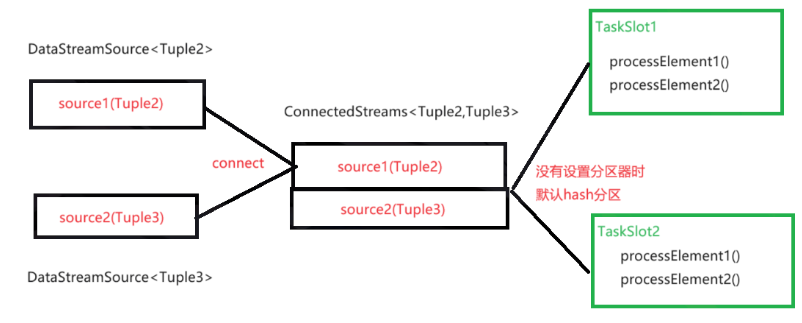

## 前言
十一月过得真是一塌糊涂,但是再怎么烂都得向前走,困难是每个人都会遇到的,但是不要沉沦太久,生活又没有那多观众,继续沉沦这是表演给谁看啊,自己痛过->感悟->一笑而过就行了
>你好十二月😊

获取执行环境(execution environment)
读取数据源(source)
定义基于数据的转换操作(transformations)
定义计算结果的输出位置(sink)
触发程序执行(execute) 

上面就是这次要介绍的api类型
## 执行环境(Execution Environment)
不同的环境,代码的提交运行的过程会有所不同。这就要求我们在提交作业执行计算时,首先必须获取当前 Flink 的运行环境,从而建立起与 Flink 框架之间的联系。只有获取了环境上下文信息,才能将具体的任务调度到不同的 TaskManager 执行。
### getExecutionEnvironment
```java
StreamExecutionEnvironment env = StreamExecutionEnvironment.getExecutionEnvironment();
```
也可以传入配置
```java 
Configuration conf = new Configuration();
        conf.set(RestOptions.BIND_PORT,"8082");
        StreamExecutionEnvironment env = StreamExecutionEnvironment.getExecutionEnvironment(conf);
        //这里我们设置端口号为 8082 ,这样我们在默认的 8081 端口就无法访问 Web UI 了,只能通过 8082 端口来访问。
```
自动获取环境如果是独立运行的就返回本地环境如果创建jar包放到集群就会返回集群环境
### createLocalEnvironment
```java
StreamExecutionEnvironment env = StreamExecutionEnvironment.createLocalEnvironment();

```
返回一个本地执行环境可以传入参数指定并行度,否则就是cpu核数
#### createRemoteEnvironment
```java
StreamExecutionEnvironment.createRemoteEnvironment("hadoop102",8081,"/opt/module/xxx.jar");
```
需要指定jobManager的端口号,并指定要在集群运行的jar包,写死
### 执行模式(Execution Mode)

默认的执行模式就是 Streaming 模式。

#### 1、batch 模式

```java
env.setRuntimeMode(RuntimeExecutionMode.BATCH);
```

#### 2、streaming 模式

```java
env.setRuntimeMode(RuntimeExecutionMode.STREAMING);
```

#### 3、自动模式

前两种方式都过于死板,打包后的程序都不能修改,所以我们一般不明确指定执行模式到底是 流处理 还是 批处理,而是执行时通过命令行来配置:

```bash
bin/flink run -Dexecution.runtime-mode=BATCH ...
```
### 触发程序执行
#### 默认执行方式
Flink 是事件驱动型的,只有等到数据到来,才会触发真正的计算,这也被称为“延迟执行”或“懒执行”(lazy execution)。所以我们需要显式地调用执行环境的 execute()方法,来触发程序执行。execute()方法将一直等待作业完成,然后返回一个执行结果(JobExecutionResult)但是这个返回对象我们一般不怎么用,而且这个返回结果在程序运行完才会返回。

默认 env.execute() 触发生成一个 Flink Job。
#### 异步执行方式
极少情况下,可能我们一套代码中有两部分处理逻辑,比如 env.execute() 之后,又进行了一些操作然后再进行 execute() ,但在 main 线程中是会阻塞的,这就需要启动一个异步的 execute() 方法。
```java
env.execute();
 
// 其他处理代码...
 
env.executeAsync();
```
## 源算子(Source)
写一个 Java Bean,注意类的属性序列化问题(这里我们的属性都是一些基本类型,Flink 是支持对它进行序列化的),Flink 会把这样的类作为一种特殊的 POJO 数据类型来对待,方便数据的解析和序列化。
```java
import java.util.Objects;
 
public class WaterSensor {
    public String id;
    public Long ts;
    public Integer vc;
    
    public WaterSensor(){}
 
    public WaterSensor(String id, Long ts, Integer vc) {
        this.id = id;
        this.ts = ts;
        this.vc = vc;
    }
 
    @Override
    public boolean equals(Object o) {
        if (this == o) return true;
        if (o == null || getClass() != o.getClass()) return false;
        WaterSensor that = (WaterSensor) o;
        return Objects.equals(id, that.id) && Objects.equals(ts, that.ts) && Objects.equals(vc, that.vc);
    }
 
    @Override
    public int hashCode() {
        return Objects.hash(id, ts, vc);
    }
 
    @Override
    public String toString() {
        return "WaterSensor{" +
                "id='" + id + '\'' +
                ", ts=" + ts +
                ", vc=" + vc +
                '}';
    }
 
    public String getId() {
        return id;
    }
 
    public void setId(String id) {
        this.id = id;
    }
 
    public Long getTs() {
        return ts;
    }
 
    public void setTs(Long ts) {
        this.ts = ts;
    }
 
    public Integer getVc() {
        return vc;
    }
 
    public void setVc(Integer vc) {
        this.vc = vc;
    }
}
```
### 读取数据
fromCollection 将集合中的数据临时放到内存中,一般作为测试数据
```java 
public static void main(String[] args) throws Exception {

    StreamExecutionEnvironment env = StreamExecutionEnvironment.getExecutionEnvironment();

    
List<Integer> data = Arrays.asList(1, 22, 3);
        DataStreamSource<Integer> ds = env.fromCollection(data);

	stream.print();

    env.execute();
}

```
真正的实际应用中,自然不会直接将数据写在代码中。通常情况下,我们会从存储介质中获取数据,一个比较常见的方式就是读取日志文件。这也是批处理中最常见的读取方式。
读取文件,需要添加文件连接器依赖:
```xml
 <dependency>
            <groupId>org.apache.flink</groupId>
            <artifactId>flink-connector-files</artifactId>
            <version>${flink.version}</version>
</dependency>
```
```java
public static void main(String[] args) throws Exception {

        StreamExecutionEnvironment env = StreamExecutionEnvironment.getExecutionEnvironment();

        FileSource<String> fileSource = FileSource.forRecordStreamFormat(
            new TextLineInputFormat(), 
            new Path("input/word.txt")//还可以从HDFS目录下读取,使用路径hdfs://...；
            ).build();

        env.fromSource(fileSource,WatermarkStrategy.noWatermarks(),"file")
    .print();

        env.execute();
}

```

从socket中读取测试用
```java
DataStream<String> stream = env.socketTextStream("localhost", 9999);

```java
public class KafkaSourceDemo {
    public static void main(String[] args) throws Exception {
        StreamExecutionEnvironment env = StreamExecutionEnvironment.getExecutionEnvironment();
        env.setParallelism(1);
 
        // 从 Kafka 读取
        KafkaSource<String> kafkaSource = KafkaSource.<String>builder()
                .setBootstrapServers("hadoop102:9092,hadoop103:9092,hadoop104:9092")    //指定kafka地址和端口
                .setGroupId("yh")  // 指定消费者组id
                .setTopics("like")  // 指定消费的topic,可以是多个用List<String>
                .setValueOnlyDeserializer(new SimpleStringSchema()) // 指定反序列化器 因为kafka是生产者 flink作为消费者要反序列化
                .setStartingOffsets(OffsetsInitializer.latest())    // 指定flink消费kafka的策略
                .build();
 
        env.fromSource(kafkaSource, WatermarkStrategy.noWatermarks(),"kafkaSource")
                .print();
 
        env.execute();
    }
    /*
     *  kafka 消费者的参数: 
     *      auto.reset.offsets:
     *          earliest: 如果有offset,从offset继续消费;如果没有 就从 最早 消费
     *          latest  : 如果有offset,从offset继续消费;如果没有 就从 最新 消费
     * flink 的 kafkaSource offset消费者策略: offsetsInitializer,默认是 earliest
     *      earliest: 一定从 最早 消费 (不管有没有offset) 
     *      latest  : 一定从 最新 消费 (不管有没有offset)
     */
}
```


还有官方自带的DataGen 不演示了
```java
public class DataGeneratorDemo {
    public static void main(String[] args) throws Exception {
        StreamExecutionEnvironment env = StreamExecutionEnvironment.getExecutionEnvironment();
        env.setParallelism(1);
 
        /**
         * 数据生成器参数说明:
         *  1. GeneratorFunction接口,需要重写 map 方法,输入类型必须是Long
         *  2. Long类型, 自动生成的数字序列(从0自增)的最大值
         *  3. 限速策略, 比如每秒生成几条数据
         *  4. 返回的数据类型
         */
        DataGeneratorSource<String> dataGeneratorSource = new DataGeneratorSource<>(
                new GeneratorFunction<Long, String>() {
                    @Override
                    public String map(Long value) throws Exception {
                        return "number: " + value;
                    }
                },
                10L,
                RateLimiterStrategy.perSecond(1),
                Types.STRING
        );
        env.fromSource(dataGeneratorSource, WatermarkStrategy.noWatermarks(),"dataGenerator")
                .print();
 
        env.execute();
    }
}
/*
number: 0
number: 1
number: 2
number: 3
number: 4
number: 5
number: 6
number: 7
number: 8
number: 9
 
Process finished with exit code 0
*/

```

如果想达到无界流的效果,直接给数据生成器的第二个参数传一个 Long.MAX_VALUE。

假如我们的第二个参数设置为100(意味着从0自增到99)。如果并行度为3,那么第二个线程将从100的1/3处(即34)开始累加,第三个线程将从100的2/3(即67)开始累加。
#### Flink支持的数据类型

1)Flink的类型系统
Flink使用“类型信息”(TypeInformation)来统一表示数据类型。TypeInformation类是Flink中所有类型描述符的基类。它涵盖了类型的一些基本属性,并为每个数据类型生成特定的序列化器、反序列化器和比较器。
2)Flink支持的数据类型
对于常见的Java和Scala数据类型,Flink都是支持的。Flink在内部,Flink对支持不同的类型进行了划分,这些类型可以在Types工具类中找到:
(1)基本类型
所有Java基本类型及其包装类,再加上Void、String、Date、BigDecimal和BigInteger。
(2)数组类型
包括基本类型数组(PRIMITIVE_ARRAY)和对象数组(OBJECT_ARRAY)。
(3)复合数据类型
	Java元组类型(TUPLE):这是Flink内置的元组类型,是Java API的一部分。最多25个字段,也就是从Tuple0~Tuple25,不支持空字段。
	Scala 样例类及Scala元组:不支持空字段。
	行类型(ROW):可以认为是具有任意个字段的元组,并支持空字段。
	POJO:Flink自定义的类似于Java bean模式的类。
(4)辅助类型
Option、Either、List、Map等。
(5)泛型类型(GENERIC)
Flink支持所有的Java类和Scala类。不过如果没有按照上面POJO类型的要求来定义,就会被Flink当作泛型类来处理。Flink会把泛型类型当作黑盒,无法获取它们内部的属性；它们也不是由Flink本身序列化的,而是由Kryo序列化的。
在这些类型中,元组类型和POJO类型最为灵活,因为它们支持创建复杂类型。而相比之下,POJO还支持在键(key)的定义中直接使用字段名,这会让我们的代码可读性大大增加。所以,在项目实践中,往往会将流处理程序中的元素类型定为Flink的POJO类型。
Flink对POJO类型的要求如下:
>类是公有(public)的
>有一个无参的构造方法
>所有属性都是公有(public)的
>所有属性的类型都是可以序列化的

3)类型提示(Type Hints)
Flink还具有一个类型提取系统,可以分析函数的输入和返回类型,自动获取类型信息,从而获得对应的序列化器和反序列化器。但是,由于Java中泛型擦除的存在,在某些特殊情况下(比如Lambda表达式中),自动提取的信息是不够精细的——只告诉Flink当前的元素由“船头、船身、船尾”构成,根本无法重建出“大船”的模样；这时就需要显式地提供类型信息,才能使应用程序正常工作或提高其性能。
为了解决这类问题,Java API提供了专门的“类型提示”(type hints)。


## 1、基本转换算子(map/filter/flatMap)

### 1.1、map

map 已经是非常熟悉的算子了,在 Scala 中、在 Spark 中,map 的特点就是一进一出。

我们只需要基于 DataStream 调用 map()方法就可以进行转换处理。方法需要传入的参数是接口 MapFunction 的实现；返回值类型还是 DataStream,不过泛型(流中的元素类型)可能改变。

下面我们实现提取上一节的 POJO 类 WaterSensor 中 id 字段的功能。

```java

public class MapDemo {

    public static void main(String[] args) throws Exception {

        StreamExecutionEnvironment env = StreamExecutionEnvironment.getExecutionEnvironment();

        env.setParallelism(1);

        DataStreamSource<WaterSensor> sensorDS = env.fromElements(

                new WaterSensor("s1", 1L, 1),

                new WaterSensor("s2", 2L, 2),

                new WaterSensor("s3", 3L, 3)

        );

        SingleOutputStreamOperator<String> map = sensorDS.map(new MapFunction<WaterSensor, String>() {

            @Override

            public String map(WaterSensor waterSensor) throws Exception {

                return waterSensor.getId();

            }

        });

        sensorDS.map(sensor -> sensor.getId());

        sensorDS.map(sensor -> {

            return sensor.getId();

        });

        sensorDS.map(WaterSensor::getId);

        sensorDS.map(new MyMapFunctionImpl());

        map.print();

        env.execute();

    }

}
```

[匿名内部类]和lambda表达式虽然简单快捷,但是实际开发中如果说我们的的这个类需要应用到多个场景中的话还是最好单独建个包(比如function),然后单独定义这个类：

```java
public class MyMapFunctionImpl implements MapFunction<WaterSensor, String> {

    @Override

    public String map(WaterSensor waterSensor) throws Exception {

        return waterSensor.getId();

    }

}
```

这么写是最规范的写法,也是良好的开发习惯。 

### 1.2、filter

filter 转换操作,顾名思义是对数据流执行一个过滤,通过一个布尔条件表达式设置过滤条件,对于每一个流内元素进行判断,若为 true 则元素正常输出,若为 false 则元素被过滤掉。

进行 filter 转换之后的新数据流的数据类型与原数据流是相同的。filter 转换需要传入的参数需要实现 FilterFunction 接口,而 FilterFunction 内要实现 filter()方法,就相当于一个返回布尔类型的条件表达式。


查看 FilterFunction 接口的源码,我们发现,这又是一个
[函数]接口(只有一个抽象方法,且被@FunctionalInterface 标注),那么实现就很容易了,我们可以使用 lambda 表达式。

案例：过滤 Id 为 "s1" 的传感器。

```java
public class FilterDemo {

    public static void main(String[] args) throws Exception {

        StreamExecutionEnvironment env = StreamExecutionEnvironment.getExecutionEnvironment();

        env.setParallelism(1);

        DataStreamSource<WaterSensor> sensorDS = env.fromElements(

                new WaterSensor("s1", 1L, 1),

                new WaterSensor("s2", 2L, 2),

                new WaterSensor("s3", 3L, 3)

        );

        sensorDS.filter(new FilterFunction<WaterSensor>() {

            @Override

            public boolean filter(WaterSensor waterSensor) throws Exception {

                return waterSensor.getId().equals("s1");

            }

        });

        SingleOutputStreamOperator<WaterSensor> res = sensorDS
                .filter((waterSensor) -> waterSensor.getId().equals("s1"));

        res.print();

        env.execute();

    }

}
```

运行结果：

```java
WaterSensor{id='s1', ts=1, vc=1}
```

可以看到,id 为 s1 的传感器被过滤输出了。 

### 1.3、flatMap

flatMap 操作又称为扁平映射,主要是将数据流中的整体(一般是集合类型)拆分成一个一个的个体使用。消费一个元素,可以产生 0 到多个元素。flatMap 可以认为是“扁平化”(flatten)和“映射”(map)两步操作的结合,也就是先按照某种规则对数据进行打散拆分,再对拆分后的元素做转换处理。

同 map 一样,flatMap 也可以使用 Lambda 表达式或者 FlatMapFunction 接口实现类的方式来进行传参,返回值类型取决于所传参数的具体逻辑,可以与原数据流相同,也可以不同。flatMap 操作会应用在每一个输入事件上面,FlatMapFunction 接口中定义了 flatMap 方法,用户可以重写这个方法,在这个方法中对输入数据进行处理,并决定是返回 0 个、1 个或多个结果数据。因此 flatMap 并没有直接定义返回值类型,而是通过一个“收集器”(Collector)来指定输出。希望输出结果时,只要调用收集器的.collect()方法就可以了；这个方法可以多次调用,也可以不调用。所以 flatMap 方法也可以实现 map 方法和 filter 方法的功能,当返回结果是 0 个的时候,就相当于对数据进行了过滤,当返回结果是 1 个的时候,相当于对数据进行了简单的转换操作。

案例 - 如果输入的数据是 sensor\_1 ,只打印 vc ,如果输入的是 sensor\_2, 既打印 ts 又打印 vc。

```java

public class FlatMapDemo {

    public static void main(String[] args) throws Exception {

        StreamExecutionEnvironment env = StreamExecutionEnvironment.getExecutionEnvironment();

        env.setParallelism(1);

        DataStreamSource<WaterSensor> sensorDS = env.fromElements(

            new WaterSensor("s1", 1L, 1),

            new WaterSensor("s2", 2L, 2),

            new WaterSensor("s3", 3L, 3)

        );

        sensorDS.flatMap(new FlatMapFunction<WaterSensor, String>() {

            @Override

            public void flatMap(WaterSensor sensor, Collector<String> out) throws Exception {

                if (sensor.getId().equals("s1")){

                    out.collect(sensor.getVc()+"");

                }else if (sensor.getId().equals("s2")){

                    out.collect(sensor.getTs()+"\n"+sensor.getVc());

                }

            }

        });

        SingleOutputStreamOperator<String> res = sensorDS.flatMap((WaterSensor sensor,Collector<String> out) -> {

            if (sensor.getId().equals("s1")) {

                out.collect(sensor.getVc() + "");

            } else if (sensor.getId().equals("s2")) {

                out.collect(sensor.getTs() + "\n" + sensor.getVc());

            }

        }).returns(Types.STRING());

        res.print();

        env.execute();

    }
    /*
    public static void main(String[] args) throws Exception {

    StreamExecutionEnvironment env = StreamExecutionEnvironment.getExecutionEnvironment();

    DataStreamSource<WaterSensor> stream = env.fromElements(

            new WaterSensor("sensor_1", 1, 1),
            new WaterSensor("sensor_1", 2, 2),
            new WaterSensor("sensor_2", 2, 2),
            new WaterSensor("sensor_3", 3, 3)

    );

    stream.flatMap(new MyFlatMap()).print();

    env.execute();
}

public static class MyFlatMap implements FlatMapFunction<WaterSensor, String> {

    @Override
    public void flatMap(WaterSensor value, Collector<String> out) throws Exception {

        if (value.id.equals("sensor_1")) {
            out.collect(String.valueOf(value.vc));
        } else if (value.id.equals("sensor_2")) {
            out.collect(String.valueOf(value.ts));
            out.collect(String.valueOf(value.vc));
        }
    }
}
*/

}
```

        注意：这次需要对返回结果的类型进行声明,flatMap 和 map(一进一出)、filter(一进一出,因为返回的结果是一个 boolean 值) 是有点不一样的,因为 flatMap 是可以一进0出、一进一出甚至一进多出的。从上面的代码中我们可以看到, faltMap 方法中是通过采集器输出的,所以就可以通过判断语句实现不同数量的输出。

输出结果：

```java
1

2

2
```

## 2、聚合算子(Aggregation)

        直观上看,基本转换算子确实是在“转换”——因为它们都是基于当前数据,去做了处理和输出。而在实际应用中,我们往往需要对大量的数据进行统计或整合,从而提炼出更有用的信息。

        聚合对应着我们 MapReduce 中的 reduce 这一步。

### 2.1、keyBy(按键分区)

        我们对海量数据做聚合肯定要进行分区并行处理,这样才能提高效率。所以在 Flink 中,要做聚合,需要先进行分区；这个操作就是通过 keyBy 来完成的。

        keyBy 是聚合前必须要用到的一个算子。keyBy 通过指定键(key),可以将一条流从逻辑上划分成不同的分区(partitions)。这里所说的分区,其实就是并行处理的子任务,也就对应着任务槽(task slot)。  
        基于不同的 key,流中的数据将被分配到不同的分区中去,这样一来,所有具有相同的 key 的数据,都将被发往同一个分区,那么下一步算子操作就将会在同一个 slot中进行处理了。

        在内部,是通过计算 key 的哈希值(hash code),对分区数进行取模运算来实现的。所以这里 key 如果是 POJO 的话,必须要重写 hashCode()方法。keyBy()方法需要传入一个参数,这个参数指定了一个或一组 key。有很多不同的方法来指定 key：比如对于 Tuple 数据类型,可以指定字段的位置或者多个位置的组合；对于 POJO 类型,可以指定字段的名称[String]；另外,还可以传入 Lambda 表达式或者实现一个键选择器(KeySelector),用于说明从数据中提取 key 的逻辑。


案例 - 根据 WaterSensor 的 id 进行分组(注意：这里是分组不是分区,一个分区可以存在多个组,因为 keyBy 只保证相同组在一个分区)。 

```java

public class KeyByDemo {

    public static void main(String[] args) throws Exception {

        StreamExecutionEnvironment env = StreamExecutionEnvironment.getExecutionEnvironment();

        env.setParallelism(2);

        DataStreamSource<WaterSensor> sensorDS = env.fromElements(

                new WaterSensor("s1", 1L, 1),

                new WaterSensor("s2", 2L, 2),

                new WaterSensor("s3", 3L, 3)

        );
// 方式1：使用匿名类实现KeySelector
        sensorDS.keyBy(new KeySelector<WaterSensor, String>() {

            @Override

            public String getKey(WaterSensor sensor) throws Exception {

                return sensor.getId();

            }

        });
 // 方式2：使用Lambda表达式
        KeyedStream<WaterSensor, String> keyedStream = sensorDS.keyBy((sensor) -> sensor.getId());

        keyedStream.print();

        env.execute();
//KeyedStream也继承自DataStream，所以基于它的操作也都归属于DataStream API。但它跟之前的转换操作得到的SingleOutputStreamOperator不同，只是一个流的分区操作，并不是一个转换算子
    }

}
```

 运行结果：

```java
2> WaterSensor{id='s1', ts=1, vc=1}

1> WaterSensor{id='s2', ts=2, vc=2}

2> WaterSensor{id='s3', ts=3, vc=3}
```

这次我们把并行度分为2,当我们调用 Sink 算子-print 的时候,它就会按照分区并行对数据进行输出,同时,它保证了相同 key 的数据在同一个分区中；当然,多个组也可以在同一个分区的,因为它只保证一个组的数据在同一个分区,没说不同组不可以在同一个分区；比如 hash值%分区数 结果相同的多个组也会被分到同一个组中。

### 2.2、sum/min/max/minBy/maxBy

有了按键分组的数据流 KeyedStream,我们就可以基于它进行聚合操作了。在 Flink 中,聚合算子和 keyBy 是成对出现的,因为把具有相同结构的数据放在一起(keyBy)再做聚合运算(聚合算子sum...)才是有意义的。就像我们 Hive 中经常把 groupBy 和 聚合函数放在一起。

-    sum()：在输入流上,对指定的字段做叠加求和的操作。
-    min()：在输入流上,对指定的字段求最小值。
-    max()：在输入流上,对指定的字段求最大值。
-    minBy()：与 min()类似,在输入流上针对指定字段求最小值。不同的是,min()只计算指定字段的最小值,其他字段会保留最初第一个数据的值；而 minBy()则会返回包含字段最小值的整条数据。
-    maxBy()：与 max()类似,在输入流上针对指定字段求最大值。两者区别与min()/minBy()完全一致。

所以在 Flink 中,聚合算子是必须在 KeyBy 之后才能出现的,它做的是组内的聚合。

```java
public class SimpleAggregationDemo {

    public static void main(String[] args) throws Exception {

        StreamExecutionEnvironment env = StreamExecutionEnvironment.getExecutionEnvironment();

        env.setParallelism(1);

        DataStreamSource<WaterSensor> sensorDS = env.fromElements(

                new WaterSensor("s1", 1L, 1),

                new WaterSensor("s1", 10L, 5),

                new WaterSensor("s2", 2L, 2),

                new WaterSensor("s3", 3L, 3)

        );

        KeyedStream<WaterSensor, String> keyedStream = sensorDS.keyBy((sensor) -> sensor.getId());

        keyedStream.max("vc").print();

        keyedStream.maxBy("vc").print();

        env.execute();

    }

}
```

这里要注意的就是 max/maxBy、min/minBy 的区别了。

```java
输入数据：

WaterSensor{id='s1', ts=1, vc=1}

WaterSensor{id='s1', ts=10, vc=12}

WaterSensor{id='s2', ts=2, vc=2}

WaterSensor{id='s3', ts=3, vc=3}

max("vc"):

WaterSensor{id='s1', ts=1, vc=1}

WaterSensor{id='s1', ts=1, vc=12}

WaterSensor{id='s2', ts=2, vc=2}

WaterSensor{id='s3', ts=3, vc=3}

maxBy("vd"):

WaterSensor{id='s1', ts=1, vc=1}

WaterSensor{id='s1', ts=10, vc=12}

WaterSensor{id='s2', ts=2, vc=2}

WaterSensor{id='s3', ts=3, vc=3}
```

### 2.3、reduce (规约聚合)

reduce 同样必须先 keyBy,再对相同组内的数据进行规约聚合,reduce 方法的特点是每个 key 的第一条数据来的时候不会立即执行 reduce 方法,而是存起来,直接输出；需要注意的是reduce的输出类型必须和输入类型一致。

reduce 方法需要传入一个实现 ReduceFunction 接口的对象,我们查看源码可以发现,这又双叒叕是一个函数接口,所以我们依然用lambda表达式这样最简洁。
```java
//调用KeyedStream的reduce方法时，需要传入一个参数，实现ReduceFunction接口。接口在源码中的定义如下：
public interface ReduceFunction<T> extends Function, Serializable {
    T reduce(T value1, T value2) throws Exception;
}
```

我们用 reduce 实现 maxBy 的功能：

```java
public class ReduceDemo {

    public static void main(String[] args) throws Exception {

        StreamExecutionEnvironment env = StreamExecutionEnvironment.getExecutionEnvironment();

        env.setParallelism(1);

        DataStreamSource<WaterSensor> sensorDS = env.fromElements(

            new WaterSensor("s1", 1L, 1),

            new WaterSensor("s1", 10L, 5),

            new WaterSensor("s2", 2L, 2),

            new WaterSensor("s3", 3L, 3)

        );

        KeyedStream<WaterSensor, String> keyedStream = sensorDS.keyBy((sensor) -> sensor.getId());

        SingleOutputStreamOperator<WaterSensor> reduce = keyedStream.reduce((sensor1, sensor2) -> new WaterSensor(sensor1.id, sensor2.ts, sensor1.getVc() + sensor2.getVc()));

        reduce.print();

        env.execute();

    }

}
```

输出结果：

```java
WaterSensor{id='s1', ts=1, vc=1}

WaterSensor{id='s1', ts=10, vc=6}

WaterSensor{id='s2', ts=2, vc=2}

WaterSensor{id='s3', ts=3, vc=3}
```

 显然利用 reduce 算子我们可以更加灵活地对数据进行处理,比如我们修该上面的代码：

```java
SingleOutputStreamOperator<WaterSensor> reduce = keyedStream.reduce((sensor1, sensor2) -> new WaterSensor(sensor1.id, sensor1.ts+sensor2.ts, sensor1.getVc() + sensor2.getVc()));
```

这样我们就可以对来的数据的每个字段进行累加。

#### 什么是有状态计算？

比如这里我们 reduce 会把每次处理的结果(状态)存下来,而且它自己会来维护,所以当相同 key 的数据再次来的时候,它才能对新旧数据再次进行聚合。

我们 reduce(value1,value2) 中,value1 指的就是之前的计算结果,也就是状态。而 value2 指的就是新来的数据。 

## 3、用户自定义函数(UDF)

### 3.1、函数类

对于大部分操作而言,都需要传入一个用户自定义函数(UDF),实现相关操作的接口,来完成处理逻辑的定义。Flink 暴露了所有 UDF 函数的接口,具体实现方式为接口或者抽象类,例如 MapFunction、FilterFunction、ReduceFunction 等。

前面对于 POJO 类型的数据,我们用匿名内部类、lambda 和 单独一个实现类都实现过。

#### 案例

这里我们再写一个简单的自定义函数 - FilterFuctionImpl ,我们希望可以通过自定义的字段名来对传进来的数据进行过滤(之前我们是写死只能过滤某个特定 id 的 WaterSensor 对象)。

```java

public class FilterFunctionImpl implements FilterFunction<WaterSensor> {

    public String sensor_id;

    public FilterFunctionImpl(String id) {

        this.sensor_id = id;

    }

    @Override

    public boolean filter(WaterSensor sensor) throws Exception {

        return this.sensor_id.equals(sensor.getId());

    }

}
```

我们修改上面 1.2 中的 FilterDemo 代码：

```java
SingleOutputStreamOperator<WaterSensor> res = sensorDS.filter(new FilterFunctionImpl("s2"));
```

运行结果：

```java
WaterSensor{id='s2', ts=2, vc=2}
```

### 3.2、富函数

        “富函数类”也是 DataStream API 提供的一个函数类的接口,所有的 Flink 函数类都有其Rich 版本。富函数类一般是以抽象类的形式出现的。例如：RichMapFunction、RichFilterFunction、RichReduceFunction 等。

        既然“富”,那么它一定会比常规的函数类提供更多、更丰富的功能。与常规函数类的不同主要在于,富函数类可以获取运行环境的上下文,并拥有一些生命周期方法,所以可以实现更复杂的功能。

> 生命周期的概念在编程中其实非常重要,到处都有体现。例如：对于 C 语言来说,我们需要手动管理内存的分配和回收,也就是手动管理内存的生命周期。分配内存而不回收,会造成内存泄漏,回收没有分配过的内存,会造成空指针[异常]而在 JVM 中,虚拟机会自动帮助我们管理对象的生命周期。对于前端来说,一个页面也会有生命周期。数据库连接、网络连接以及文件描述符的创建和关闭,也都形成了生命周期。所以生命周期的概念在编程中是无处不在的,需要我们多加注意。

Rich Function 有生命周期的概念。典型的生命周期方法有：

-   open()方法,是 Rich Function 的初始化方法,也就是会开启一个算子的生命周期。当一个算子的实际工作方法例如 map()或者 filter()方法被调用之前,open()会首先被调用。所以像文件 IO 的创建,数据库连接的创建,配置文件的读取等等这样一次性的工作,都适合在 open()方法中完成。。
-   close()方法,是生命周期中的最后一个调用的方法,类似于解构方法。一般用来做一些清理工作。

需要注意的是,这里的生命周期方法,对于一个并行子任务来说只会调用一次；而对应的,实际工作方法,例如 RichMapFunction 中的 map(),在每条数据到来后都会触发一次调用。


我们可以看到,RichMapFunction 是一个抽象类,它继承了 AbstractRichFunction 这个抽象类和 MapFunction 这个函数接口。


而 AbstractRichFunction 这个抽象类又为它提供了好多关于生命周期、上下文的管理方法。 

#### 案例

我们先用有界数据流来看一下这些方法是什么时候被调用的,这里先不去设置并行度(本地环境默认等于机器的cpu核数)。

```java

public class RichFunctionDemo {

    public static void main(String[] args) throws Exception {

        StreamExecutionEnvironment env = StreamExecutionEnvironment.getExecutionEnvironment();

        DataStreamSource<Integer> ds = env.fromElements(1, 2, 3, 4);

        SingleOutputStreamOperator<Integer> map = ds.map(new RichMapFunction<Integer, Integer>() {

            @Override

            public Integer map(Integer value) throws Exception {

                return value + 1;

            }

            @Override

            public void open(Configuration parameters) throws Exception {

                super.open(parameters);

                RuntimeContext runtimeContext = getRuntimeContext();

                int indexOfThisSubtask = runtimeContext.getIndexOfThisSubtask();

                String taskNameWithSubtasks = runtimeContext.getTaskNameWithSubtasks();

                System.out.println(
                        "子任务线程编号: " + indexOfThisSubtask + " 启动, 子任务名称: " + taskNameWithSubtasks + "调用 open()");

            }

            @Override

            public void close() throws Exception {

                super.close();

                RuntimeContext runtimeContext = getRuntimeContext();

                int indexOfThisSubtask = runtimeContext.getIndexOfThisSubtask();

                String taskNameWithSubtasks = runtimeContext.getTaskNameWithSubtasks();

                System.out.println(
                        "子任务线程编号: " + indexOfThisSubtask + " 启动, 子任务名称: " + taskNameWithSubtasks + "调用 close()");

            }

        });

        map.print();

        env.execute();

    }

}
```

 运行结果：

```java
子任务线程编号: 4 启动, 子任务名称: Map -> Sink: Print to Std. Out (5/16)#0调用 open()

子任务线程编号: 14 启动, 子任务名称: Map -> Sink: Print to Std. Out (15/16)#0调用 open()

子任务线程编号: 7 启动, 子任务名称: Map -> Sink: Print to Std. Out (8/16)#0调用 open()

子任务线程编号: 5 启动, 子任务名称: Map -> Sink: Print to Std. Out (6/16)#0调用 open()

子任务线程编号: 8 启动, 子任务名称: Map -> Sink: Print to Std. Out (9/16)#0调用 open()

子任务线程编号: 6 启动, 子任务名称: Map -> Sink: Print to Std. Out (7/16)#0调用 open()

子任务线程编号: 2 启动, 子任务名称: Map -> Sink: Print to Std. Out (3/16)#0调用 open()

子任务线程编号: 13 启动, 子任务名称: Map -> Sink: Print to Std. Out (14/16)#0调用 open()

子任务线程编号: 15 启动, 子任务名称: Map -> Sink: Print to Std. Out (16/16)#0调用 open()

子任务线程编号: 9 启动, 子任务名称: Map -> Sink: Print to Std. Out (10/16)#0调用 open()

子任务线程编号: 11 启动, 子任务名称: Map -> Sink: Print to Std. Out (12/16)#0调用 open()

子任务线程编号: 12 启动, 子任务名称: Map -> Sink: Print to Std. Out (13/16)#0调用 open()

子任务线程编号: 0 启动, 子任务名称: Map -> Sink: Print to Std. Out (1/16)#0调用 open()

子任务线程编号: 10 启动, 子任务名称: Map -> Sink: Print to Std. Out (11/16)#0调用 open()

子任务线程编号: 3 启动, 子任务名称: Map -> Sink: Print to Std. Out (4/16)#0调用 open()

子任务线程编号: 1 启动, 子任务名称: Map -> Sink: Print to Std. Out (2/16)#0调用 open()

12> 4

11> 3

10> 2

13> 5

子任务线程编号: 0 启动, 子任务名称: Map -> Sink: Print to Std. Out (1/16)#0调用 close()

子任务线程编号: 13 启动, 子任务名称: Map -> Sink: Print to Std. Out (14/16)#0调用 close()

子任务线程编号: 4 启动, 子任务名称: Map -> Sink: Print to Std. Out (5/16)#0调用 close()

子任务线程编号: 7 启动, 子任务名称: Map -> Sink: Print to Std. Out (8/16)#0调用 close()

子任务线程编号: 1 启动, 子任务名称: Map -> Sink: Print to Std. Out (2/16)#0调用 close()

子任务线程编号: 11 启动, 子任务名称: Map -> Sink: Print to Std. Out (12/16)#0调用 close()

子任务线程编号: 10 启动, 子任务名称: Map -> Sink: Print to Std. Out (11/16)#0调用 close()

子任务线程编号: 8 启动, 子任务名称: Map -> Sink: Print to Std. Out (9/16)#0调用 close()

子任务线程编号: 5 启动, 子任务名称: Map -> Sink: Print to Std. Out (6/16)#0调用 close()

子任务线程编号: 14 启动, 子任务名称: Map -> Sink: Print to Std. Out (15/16)#0调用 close()

子任务线程编号: 2 启动, 子任务名称: Map -> Sink: Print to Std. Out (3/16)#0调用 close()

子任务线程编号: 6 启动, 子任务名称: Map -> Sink: Print to Std. Out (7/16)#0调用 close()

子任务线程编号: 12 启动, 子任务名称: Map -> Sink: Print to Std. Out (13/16)#0调用 close()

子任务线程编号: 15 启动, 子任务名称: Map -> Sink: Print to Std. Out (16/16)#0调用 close()

子任务线程编号: 3 启动, 子任务名称: Map -> Sink: Print to Std. Out (4/16)#0调用 close()

子任务线程编号: 9 启动, 子任务名称: Map -> Sink: Print to Std. Out (10/16)#0调用 close()
```

 我们再用无界数据流进行模拟,这次设置并行度为 2,修改上面的代码：

```java
DataStreamSource<String> ds = env.socketTextStream("hadoop102", 9999);

SingleOutputStreamOperator<Integer> map = ds.map(new RichMapFunction<String, Integer>() {

    @Override

    public Integer map(String value) throws Exception {

        return Integer.parseInt(value) + 1;

    }

    @Override

    public void open(Configuration parameters) throws Exception {

        super.open(parameters);

        System.out.println("子任务线程编号: " + getRuntimeContext().getIndexOfThisSubtask() + " 启动, 子任务名称: "
                + getRuntimeContext().getTaskNameWithSubtasks() + "调用 open()");

    }

    @Override

    public void close() throws Exception {

        super.close();

        System.out.println("子任务线程编号: " + getRuntimeContext().getIndexOfThisSubtask() + " 启动, 子任务名称: "
                + getRuntimeContext().getTaskNameWithSubtasks() + "调用 close()");

    }

});
```


#### 结论

RichXXXFunction：富函数

-   多了生命周期管理方法：
    -   open()：每个子任务,在启动时调用一次
        
    -   close()：每个子任务,在结束时调用一次
        
        -   如果是flink程序异常挂掉,不会调用 close()
            
        -   如果是正常调用 flink 的 cancel 命令或者web ui 端的 cancel ,可以 close()
            
-   多了运行时上下文
    -   可以获取一些运行时的环境信息,比如 子任务编号、名称 ......

  
以后我们开发的时候,如果 Flink 程序启动时需要执行一次,关闭时需要执行一次的场景下就可以使用这些富函数了。


## 1、物理分区算子

常见的物理分区策略有随机分配（Random）、[轮询]分配（Round-Robin）、重缩放（Rescale）和广播（Broadcast），下边我们分别来做了解。

此外还有我们之前用过的 keyBy 聚合算子，它也是一个分区算子。

### 1.1、随机分区（shuffle）

```java

public class PartitionDemo {

    public static void main(String[] args) throws Exception {

        StreamExecutionEnvironment env = StreamExecutionEnvironment.getExecutionEnvironment();

        env.setParallelism(2);

        DataStreamSource<String> socketDS = env.socketTextStream("localhost", 9999);

        socketDS.shuffle().print();

        env.execute();

    }

}
```

这里的下游算子[并行]度在这个案例中指的是我们的 Sink（print）算子，因为我们的并行度是 2 ，所以 random.nextInnt(2) 的结果只会是 0 或 1，也就是说我们的数据会被随机分到这两个编号的任务槽中。 

运行结果：

```java
1>4

2>5

1>4

1>2

1>1

2>3

1>5
```

可以看到，随机分区的结果，数据是被随机分到各个区的并没有什么规律。 

### 1.2、轮询分区（reblancce）

轮询分区就是根据并行度把数据对每个下游的算子进行轮流分配。这种处理方式非常适合于当 数据源倾斜 的情况下，我们读取的时候利用轮询分区的方式均匀的把数据分给下游的算子。


分区逻辑： 

```java
socketDS.rebalance().print();
```

运行结果：

```java
2> 1

1> 2

2> 3

1> 1

2> 5

1> 2

2> 2

1> 1
```

###  1.3、重缩放分区（rescale）

重缩放分区和轮询分区特别相似，对于下游的 n 个子任务，我们假设有 2 个 source 算子（不一定就是 source 而是带有分区方法的算子），那么使用轮询分区每个 source 算子次都要 n 个子任务都轮询发送数据。而重缩放分区的逻辑就是，每个 source 算子只负责 n/2 个任务，

所以当下游任务（数据接收方）的数量是上游任务（数据发送方）数量的整数倍时，rescale的效率明显会更高。比如当上游任务数量是 2，下游任务数量是 6 时，上游任务其中一个分区的数据就将会平均分配到下游任务的 3 个分区中。由于 rebalance 是所有分区数据的“重新平衡”，当 TaskManager 数据量较多时，这种跨节点的网络传输必然影响效率；而如果我们配置的 task slot 数量合适，用 rescale 的方式进行“局部重缩放”，就可以让数据只在当前 TaskManager 的多个 slot 之间重新分配，从而避免了网络传输带来的损耗。  
从底层实现上看，rebalance 和 rescale 的根本区别在于任务之间的连接机制不同。rebalance将会针对所有上游任务（发送数据方）和所有下游任务（接收数据方）之间建立通信通道，这是一个笛卡尔积的关系；而 rescale 仅仅针对每一个任务和下游对应的部分任务之间建立通信通道，节省了很多资源。



```java
socketDS.rescale().print();
```

这里由于 Socket 这种数据源只支持一个 Source 算子读取，所以不做演示。

### 1.4、广播

广播类似于一种轮询，只不过它每次轮询都会把每个数据发送给所有下游任务。

```java
socketDS.broadcast().print();
```

运行结果： 

```java
1> 1

2> 1

2> 2

1> 2

1> 3

2> 3

1> 4

2> 4

2> 5

1> 5
```

###  1.5、全局分区（global）

全局分区会把所有数据都发往下游的第一个任务当中。

```java
socketDS.global().print();
```

并行度为 2 的情况下，运行结果： 

```java
1> 1

1> 2

1> 3

1> 4

1> 5
```

### 1.6、自定义分区（custom）

我们可以通过使用 partitionCustom(partitioner，keySelector) 方法来自定义分区策略。在调用时，方法需要传入两个参数，第一个是自定义分区器（Partitioner）对象，第二个是应用分区器的键字段选择器，我们一般都是自己实现一个 KeySelector。

#### 1、自定义分区器

```java
public class MyPartitioner implements Partitioner<String> {

    @Override

    public int partition(String key, int numPartitions) {

        return Integer.parseInt(key) % numPartitions;

    }

}
```

```java
public class CustomPartitionDemo {

    public static void main(String[] args) throws Exception {

        StreamExecutionEnvironment env = StreamExecutionEnvironment.getExecutionEnvironment();

        env.setParallelism(2);

        DataStreamSource<String> socketDS = env.socketTextStream("localhost", 9999);

        socketDS.partitionCustom(new MyPartitioner(), key -> key).print();

        env.execute();

    }

}
```

运行结果

```java
2> 1

1> 2

2> 3

1> 4

2> 5

1> 6

1> 8
```

可以看到，奇数都被分到 2 号线程，偶数被分到了 1 号。

## 2、分流

分流就是把我们传进来的数据流根据一定的规则进行筛选后，将符合条件的数据放到对应的流里。

### 2.1、Filter 

读取一个整数数据流，将数据划分为奇数数据流和偶数数据流。其实我们上面在自定义分区器已经实现了，但那是并行度为 2 的情况刚好达到的这么一种效果。

```java

public class SplitByFilterDemo {

    public static void main(String[] args) throws Exception {

        StreamExecutionEnvironment env = StreamExecutionEnvironment.getExecutionEnvironment();

        env.setParallelism(2);

        DataStreamSource<String> socketDS = env.socketTextStream("localhost", 9999);

        socketDS.filter(new FilterFunction<String>() {

            @Override

            public boolean filter(String value) throws Exception {

                if (Integer.parseInt(value) % 2 == 0) {

                    return true;

                }

                return false;

            }

        });

        socketDS.filter(value -> Integer.parseInt(value) % 2 == 0).print("偶数流");

        socketDS.filter(value -> Integer.parseInt(value) % 2 == 1).print("奇数流");

        env.execute();

    }

}
```

运行结果：

```java
偶数流:1> 2

奇数流:2> 1

奇数流:1> 3

偶数流:2> 4

偶数流:1> 6

偶数流:2> 8

奇数流:1> 7

奇数流:2> 9
```

缺点：明显每次 Source 算子传过来的数据需要把所有数据发送给每个转换算子（Filter），明显[性能]要差一些。

### 2.2、侧输出流

侧输出流后面我们再做详细介绍，这里只做简单使用。简单来说，只需要调用上下文 context 的 .output() 方法，就可以输出任意类型的数据了，而侧输出流的标记和提取，都离不开一个“输出标签” （OutputTag），指定了侧输出流的 id 和 类型。

案例-我们根据上一节的 POJO 类 WaterSensor 的 id 进行分流（将s1和s2分别分到不同的数据流中去，把非s1、s2的数据保留在主流当中）

```java


public class SideOutputDemo {

    public static void main(String[] args) throws Exception {

        StreamExecutionEnvironment env = StreamExecutionEnvironment.getExecutionEnvironment();

        env.setParallelism(1);

        DataStreamSource<WaterSensor> sensorDS = env.fromElements(

                new WaterSensor("s1", 1L, 1),

                new WaterSensor("s2", 2L, 2),

                new WaterSensor("s3", 3L, 3),

                new WaterSensor("s2", 2L, 2)

        );

        OutputTag<WaterSensor> s1 = new OutputTag<WaterSensor>("s1", Types.POJO(WaterSensor.class));

        OutputTag<WaterSensor> s2 = new OutputTag<WaterSensor>("s2", Types.POJO(WaterSensor.class));

        SingleOutputStreamOperator<WaterSensor> process = sensorDS
                .process(new ProcessFunction<WaterSensor, WaterSensor>() {

                    @Override

                    public void processElement(WaterSensor sensor, Context context, Collector<WaterSensor> out)
                            throws Exception {

                        if (sensor.getId().equals("s1")) {

                            context.output(s1, sensor);

                        } else if (sensor.getId().equals("s2")) {

                            context.output(s2, sensor);

                        } else {

                            out.collect(sensor);

                        }

                    }

                });

        process.print("主流");

        process.getSideOutput(s1).print("测流s1");

        process.getSideOutput(s2).print("测流s2");

        env.execute();

    }

}
```

运行结果：

```java
测流s1> WaterSensor{id='s1', ts=1, vc=1}

测流s2> WaterSensor{id='s2', ts=2, vc=2}

主流> WaterSensor{id='s3', ts=3, vc=3}

测流s2> WaterSensor{id='s2', ts=2, vc=2}
```

 这种方式相较于 Filter 明显要效率更高，因为它对每个数据只处理一次。

## 3、合流

在实际应用中，我们经常会遇到来源不同的多种数据流，需要将它们进行联合处理。这就需要先进行合流，Flink 为我们提供了相应的 API。

### 3.1、联合（Union）

联合是最简单的合流操作，就是直接将多条数据流合在一起。但是它要求每个流中的数据类型必须是相同的，合并之后的新流会包括所有流中的元素，数据类型不变。

```java
public class UnionDemo {

    public static void main(String[] args) throws Exception {

        StreamExecutionEnvironment env = StreamExecutionEnvironment.getExecutionEnvironment();

        env.setParallelism(1);

        DataStreamSource<Integer> source1 = env.fromElements(1, 2, 3, 4, 5);

        DataStreamSource<Integer> source2 = env.fromElements(11, 22, 33, 44, 55);

        DataStreamSource<String> source3 = env.fromElements("1", "2", "3", "4", "5");

        DataStream<Integer> union = source1.union(source2, source3.map(Integer::valueOf));

        union.print();

        env.execute();

    }

}
```

总结：

1.  使用 union 时，每条流的数据类型必须一致
2.  可以合并多条流

### 3.2、连接（Connect）

流的联合虽然简单，不过受限于数据类型不能改变，灵活性大打折扣，所以实际应用较少出现。除了联合（union），Flink 还提供了另外一种方便的合流操作——连接（connect）。顾名思义，这种操作就是直接把两条流像接线一样对接起来。

为了处理更加灵活，连接操作允许流的数据类型不同。但我们知道一个 DataStream 中的数据只能有唯一的类型，所以连接得到的并不是 DataStream，而是一个“连接流”（ConnectedStreams）。连接流可以看成是两条流形式上的“统一”，被放在了一个同一个流中；事实上内部仍保持各自的数据形式不变，彼此之间是相互独立的。要想得到新的 DataStream，还需要进一步定义一个“同处理”（co-process）转换操作，用来说明对于不同来源、不同类型的数据，怎样分别进行处理转换、得到统一的输出类型。所以整体上来，两条流的连接就像是“一国两制”，两条流可以保持各自的数据类型、处理方式也可以不同，不过最终还是会统一到同一个 DataStream 中。



#### （1）CoMapFunction 

```java

public class ConnectDemo {

    public static void main(String[] args) throws Exception {

        StreamExecutionEnvironment env = StreamExecutionEnvironment.getExecutionEnvironment();

        env.setParallelism(1);

        DataStreamSource<Integer> source1 = env.fromElements(1, 2, 3, 4, 5);

        DataStreamSource<String> source2 = env.fromElements("a", "b", "c", "d", "e");

        ConnectedStreams<Integer, String> connectedStreams = source1.connect(source2);

        SingleOutputStreamOperator<String> res = connectedStreams.map(new CoMapFunction<Integer, String, String>() {

            @Override

            public String map1(Integer value) throws Exception {

                return String.valueOf(value);

            }

            @Override

            public String map2(String value) throws Exception {

                return value;

            }

        });

        res.print();

        env.execute();

    }

}
```

运行结果：

```java
1

a

2

b

3

c

4

d

5

e
```

总结：

1.  一次只能连接 2 条流
2.  流的数据类型可以不一样
3.  连接后可以调用 map（实现 CoMapFunction 接口）、flatMap（实现 CoFlatMapFunction接口）、process（实现 CoProcessFunction 接口） 来处理，但是各处理各的

#### （2）CoFlatMapFunction 

        flatMap 和 map 一样，同样对两种数据流实现两种不同的处理方法（flatMap1 和 flatMap2）。

#### （3）CoProcessFunction

        调用 .process()时，传入的则是一个 CoProcessFunction 实现类。抽象类CoProcessFunction 在源码中定义如下：

```java
public abstract class CoProcessFunction<IN1, IN2, OUT> extends AbstractRichFunction {

    ...

    public abstract void processElement1(IN1 value, Context ctx, Collector<OUT> out) throws Exception;

    public abstract void processElement2(IN2 value, Context ctx, Collector<OUT> out) throws Exception;

    public void onTimer(long timestamp, OnTimerContext ctx, Collector<OUT> out) throws Exception {
    }

    public abstract class Context {...}

...

}
```

它需要实现的也是两个方法（processElement1、processElement2），当数据到来的时候，它会根据其来源调用其中的一个方法进行处理。CoProcessFunction 同样可以通过上下文 ctx 来访问 timestamp、水位线，并通过 TimerService 注册定时器；另外也提供了.onTimer()方法，用于定义定时触发的处理操作。

案例-我们创建两个数据流（一个二元组，一个三元组），要求根据两个不同类型元组的第一个字段匹配，以字符串的形式输出该元组。

```java


public class ConnectKeyByDemo {

    public static void main(String[] args) throws Exception {

        StreamExecutionEnvironment env = StreamExecutionEnvironment.getExecutionEnvironment();

        env.setParallelism(1);

        DataStreamSource<Tuple2<Integer, String>> source1 = env.fromElements(

                Tuple2.of(1, "a1"),

                Tuple2.of(1, "a2"),

                Tuple2.of(3, "b"),

                Tuple2.of(4, "c")

        );

        DataStreamSource<Tuple3<Integer, String, Integer>> source2 = env.fromElements(

                Tuple3.of(1, "a1", 1),

                Tuple3.of(1, "a2", 2),

                Tuple3.of(3, "b", 1),

                Tuple3.of(4, "c", 1)

        );

        ConnectedStreams<Tuple2<Integer, String>, Tuple3<Integer, String, Integer>> connect = source1.connect(source2);

        SingleOutputStreamOperator<String> process = connect
                .process(new CoProcessFunction<Tuple2<Integer, String>, Tuple3<Integer, String, Integer>, String>() {

                    Map<Integer, List<Tuple2<Integer, String>>> s1Cache = new HashMap<>();

                    Map<Integer, List<Tuple3<Integer, String, Integer>>> s2Cache = new HashMap<>();

                    @Override

                    public void processElement1(Tuple2<Integer, String> value, Context ctx, Collector<String> out)
                            throws Exception {

                        Integer id = value.f0;

                        if (!s1Cache.containsKey(id)) {

                            List<Tuple2<Integer, String>> list = new ArrayList<>();

                            list.add(value);

                            s1Cache.put(id, list);

                        } else {

                            s1Cache.get(id).add(value);

                        }

                        if (s2Cache.containsKey(id)) {

                            for (Tuple3<Integer, String, Integer> s2Element : s2Cache.get(id)) {

                                out.collect("s1:" + value + "<-------->" + "s2:" + s2Element);

                            }

                        }

                    }

                    @Override

                    public void processElement2(Tuple3<Integer, String, Integer> value, Context ctx,
                            Collector<String> out) throws Exception {

                        Integer id = value.f0;

                        if (!s2Cache.containsKey(id)) {

                            List<Tuple3<Integer, String, Integer>> list = new ArrayList<>();

                            list.add(value);

                            s2Cache.put(id, list);

                        } else {

                            s2Cache.get(id).add(value);

                        }

                        if (s1Cache.containsKey(id)) {

                            for (Tuple2<Integer, String> s1Element : s1Cache.get(id)) {

                                out.collect("s2:" + value + "<-------->" + "s1:" + s1Element);

                            }

                        }

                    }

                });

        process.print();

        env.execute();

    }

}
```

运行结果：

```java
s2:(1,a1,1)<-------->s1:(1,a1)

s1:(1,a2)<-------->s2:(1,a1,1)

s2:(1,a2,2)<-------->s1:(1,a1)

s2:(1,a2,2)<-------->s1:(1,a2)

s2:(3,b,1)<-------->s1:(3,b)

s2:(4,c,1)<-------->s1:(4,c)
```

我们设置并行度为 2 再运行：

```java
env.setParallelism(2);
```

运行结果：

第一次：

```java
2> s1:(1,a2)<-------->s2:(1,a1,1)

1> s1:(1,a1)<-------->s2:(1,a2,2)
```

第二次：

```cobol
2> s2:(1,a2,2)<-------->s1:(1,a2)

1> s2:(1,a1,1)<-------->s1:(1,a1)

2> s2:(4,c,1)<-------->s1:(4,c)

1> s2:(3,b,1)<-------->s1:(3,b)
```

 我们发现，当并行度为多个的时候，如果不指定分区器的话，每次的运行结果都不一样。

        在CoProcessFunction中，可以通过RuntimeContext对象来获取自己的任务编号。所以我们通过在 processElement1 和 processElement2 方法中 调用getRuntimeContext().getIndexOfThisSubtask() 方法获得当前数据所在的 任务编号可以发现，几乎每次数据的分区结果都不一样，但元组对象的 hash值却是一样的。具体分区细节还得去看源码。


指定按照 元组的第一个字段进行 keyBy 分区： 

```java
ConnectedStreams<Tuple2<Integer, String>, Tuple3<Integer, String, Integer>> connect = source1.connect(source2).keyBy(s1 -> s1.f0,s2->s2.f0);
```

运行结果：

```java
1> s1:(4,c)<-------->s2:(4,c,1)

2> s1:(1,a1)<-------->s2:(1,a1,1)

2> s2:(1,a2,2)<-------->s1:(1,a1)

2> s1:(1,a2)<-------->s2:(1,a1,1)

2> s1:(1,a2)<-------->s2:(1,a2,2)

2> s1:(3,b)<-------->s2:(3,b,1)
```

输出算子待续